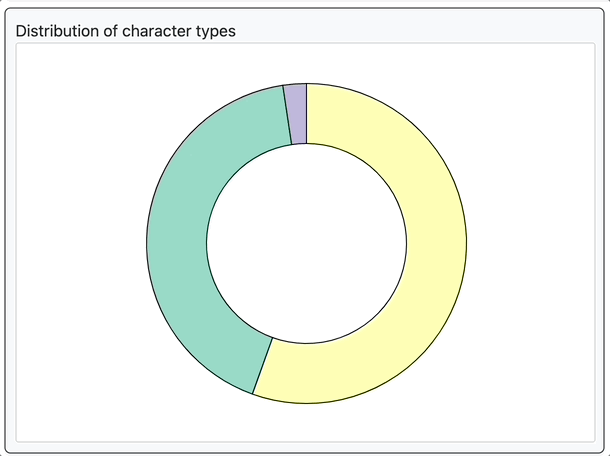

# Character Distribution Visualization

This repository contains a data visualization project using D3.js to analyze and visualize character distribution in a given text.





## Features

- Analyze character distribution of vowels, consonants, and punctuation marks.
- Visualize character distribution using a pie chart and a bar chart.
- Interact with the pie chart to explore detailed character distribution in the text.

## Getting Started

1. Clone this repository to your local machine:

   ```shell
   git clone https://github.com/your-username/character-distribution-visualization.git


### Open the index.html file in your web browser to use the character distribution visualization.

## Usage

### The JavaScript code in the provided file (main.js) analyzes character distribution in a given text and visualizes the results. The code performs the following tasks:

- Parses the input text to count vowels, consonants, and punctuation marks.
- Creates a pie chart showing the overall character distribution.
- Allows users to interact with the pie chart, selecting a character type to view detailed distribution in the bar chart.
- Updates the bar chart based on user interactions, displaying character distribution details.

You can customize the code to analyze and visualize character distribution for different text inputs or improve the interactivity of the visualization.

## Additional Information
The code uses D3.js for data visualization. Make sure you have the necessary D3.js library included in your project for the visualization to work. The code is designed for educational and analytical purposes.

Feel free to modify the code to suit your specific character distribution analysis needs. You can also extend the project to add more features or enhance the interactivity of the visualization.

## Happy character distribution analysis!