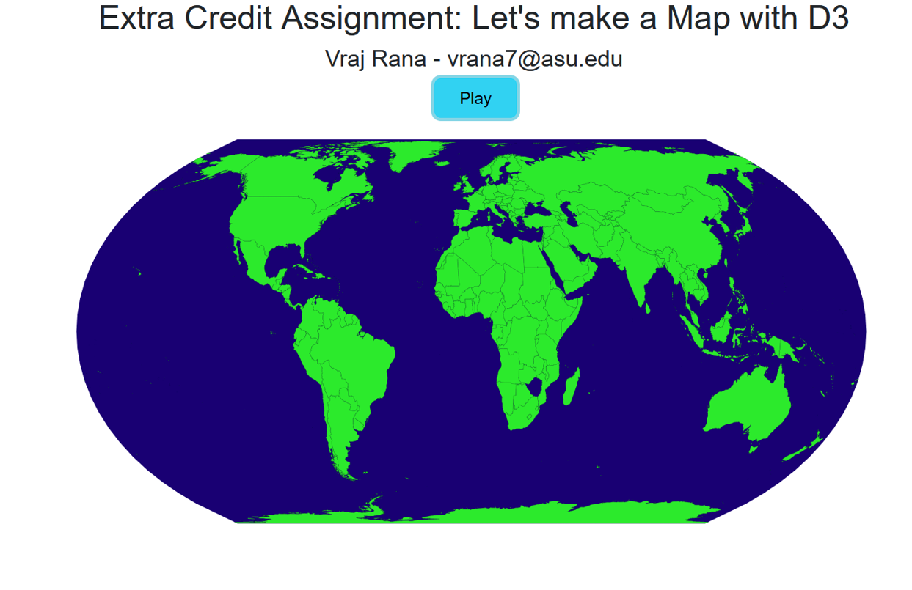
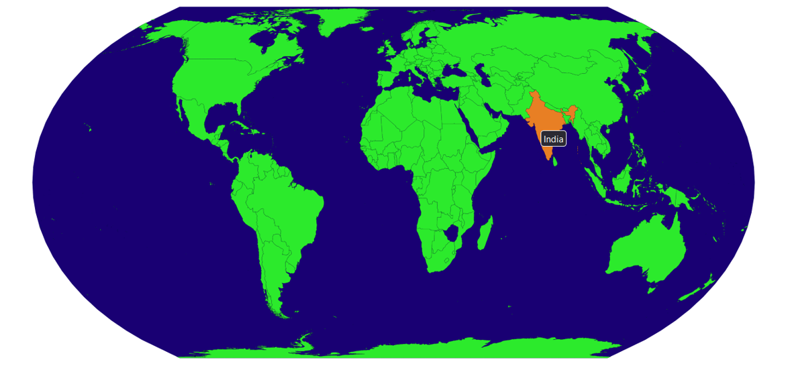
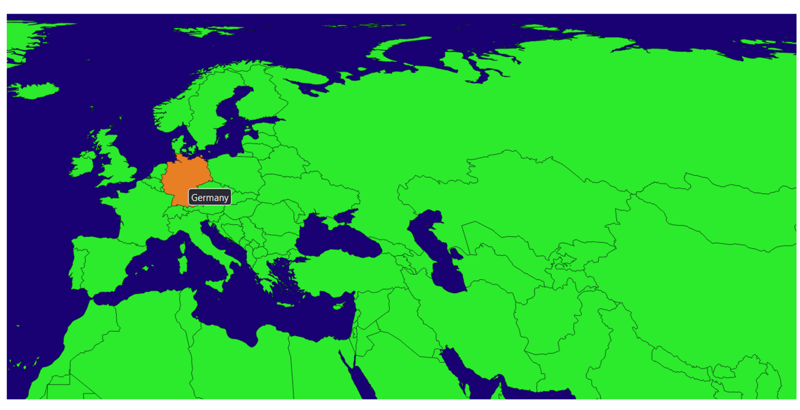

# World Map Visualization

This repository contains a data visualization project using D3.js to create an interactive world map visualization.





## Features

- Display a world map with countries.
- Implement zoom functionality to explore different regions.
- Display country names as tooltips on hover.

## Getting Started

1. Clone this repository to your local machine:

   ```shell
   git clone https://github.com/your-username/world-map-visualization.git

### Open the index.html file in your web browser to use the world map visualization.

## Usage

The JavaScript code in the provided file (main.js) uses D3.js to create an interactive world map visualization. The code performs the following tasks:

- Loads country data from a JSON file (data/countries50m.json).
- Renders a world map with countries.
- Implements zoom functionality, allowing users to explore different regions of the map.
- Displays country names as tooltips when hovering over the countries.

You can customize the code to load different map data or enhance the interactivity of the map visualization. This project is a great starting point for creating interactive maps for educational or informational purposes.

## Additional Information
The code uses D3.js and the GeoJSON format for map data. Make sure you have the necessary D3.js library and GeoJSON file included in your project for the visualization to work. Feel free to modify the code to suit your specific map visualization needs, such as adding additional layers, data overlays, or interactions.

## Enjoy exploring the world with this interactive map visualization!