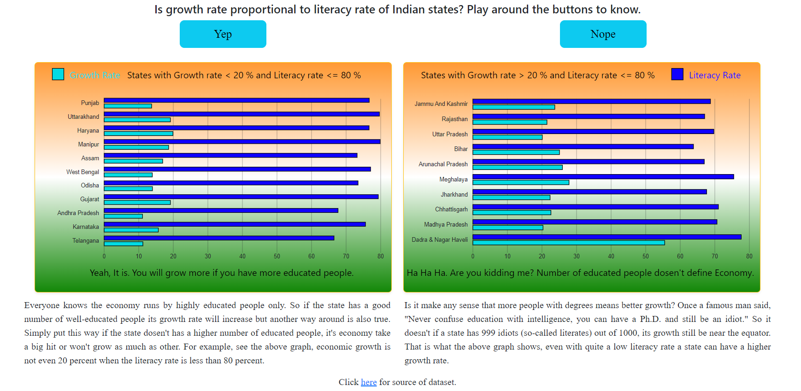

# Data Visualization with D3.js

This repository contains a data visualization project using D3.js to create interactive bar charts. The project focuses on illustrating the relationship between literacy rates, growth rates, and the economic performance of different states.

## Features

- Visualize the literacy rates, growth rates, and the economic performance of various states.
- Interact with the bar charts to see detailed information for each state.
- Explore the dataset to draw insights into the impact of education on economic growth.

### Open the index.html file in your web browser to view the visualization.

### Usage

### The D3.js code in the JavaScript file (main.js) creates two interactive bar charts:

## Chart One: States with High Growth Rate

- This chart displays states with a growth rate greater than 20% and a literacy rate less than or equal to 80%.
Hover over bars to view state-specific information.
Chart Two: States with Low Growth Rate

- This chart displays states with a growth rate less than or equal to 20% and a literacy rate less than or equal to 80%.
Hover over bars to view state-specific information.
Data Source

## The dataset used in this project is sourced from [Kaggle](https://www.kaggle.com/datasets/rajanand/education-in-india?select=2015_16_Statewise_Secondary.csv).

## Additional Information
You can find more information and details about the project by clicking here.
Feel free to explore the code, modify it, and use it for your data visualization projects.

## Happy data visualizing!